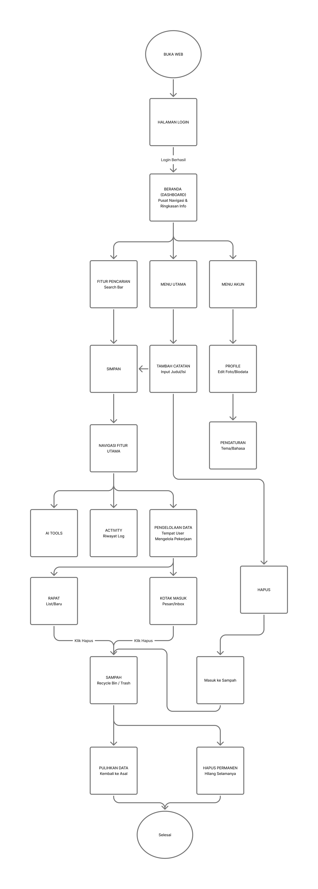

# Nama Aplikasi
Aplikasi Asisten Penulisan Berbasis Web Flask

# Kegunaan Aplikasi

Aplikasi yang dirancang untuk membantu proses penulisan agar lebih cepat, rapi, dan terstruktur dengan memanfaatkan teknologi AI. Aplikasi ini menyediakan fitur AI Writing Assistant untuk memberikan saran serta perbaikan otomatis pada teks, sehingga kualitas tata bahasa, kejelasan, dan struktur tulisan dapat ditingkatkan.

Selain itu, aplikasi ini dilengkapi dengan fitur summarizer dan translation untuk meringkas dokumen serta menerjemahkan teks ke berbagai bahasa. Tersedia juga suggestion note yang membantu penyesuaian konten sesuai kebutuhan. Hasil catatan atau rapat dapat diekspor ke format PDF dan Excel, serta mendukung integrasi dengan berbagai model AI seperti Gemini, GPT, DeepSeek, dan Grok sesuai kebutuhan pengguna.

# Flowchart

# Perkenalan Tim
- **Aksyal Fiqih Ikhtiar** - [Mengerjakan fitur note, menu dashboard, menu activity, admin panel & ai engine]
- **Andrean Taufik Hidayatullah** - [Mengerjakan fitur inbox, menu setting & dark mode]
- **Fathih Muhammad Basrowi** - [Mengerjakan fitur ai tools]
- **Ganang Setya Putra** - [Mengerjakan fitur rapat, ai chatbot, ai tools, landingpage & auth]

# Link Video Dokumentasi
Anda dapat menonton video dokumentasi aplikasi melalui tautan berikut:
[Klik di sini](https://youtu.be/yyo4zW-AFgI?si=L5XBQA23MZYEx7mW)
