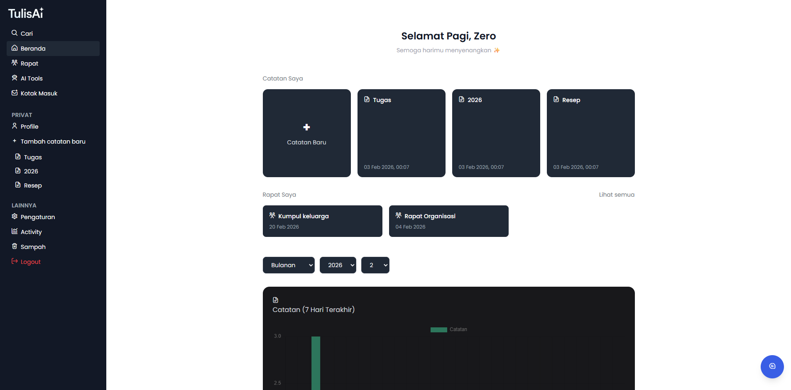
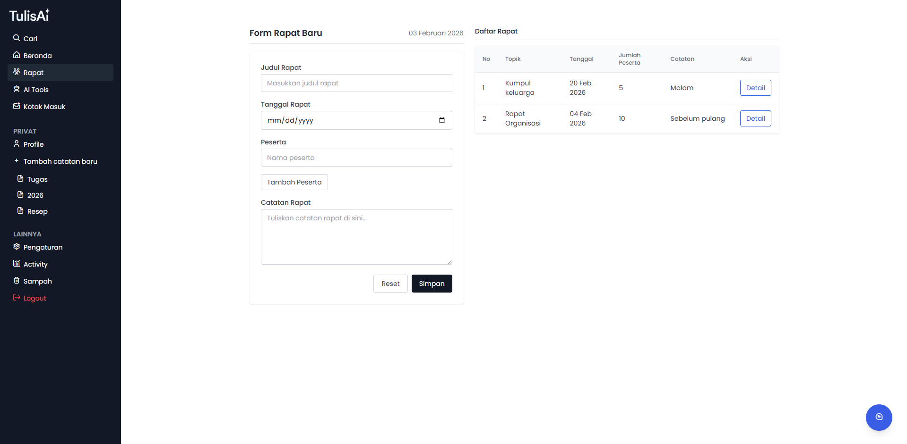
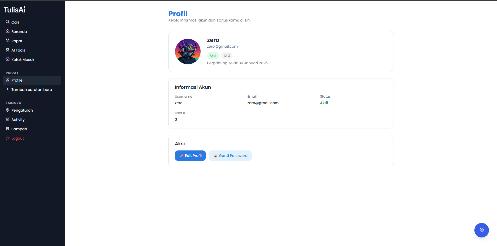
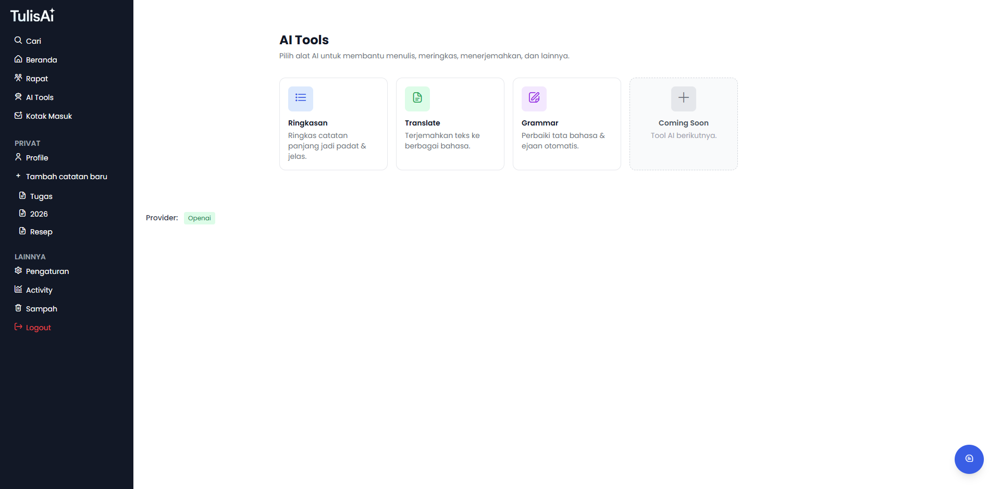
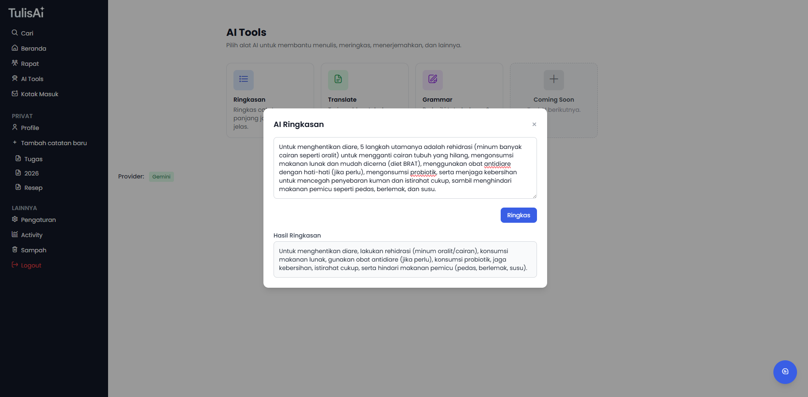
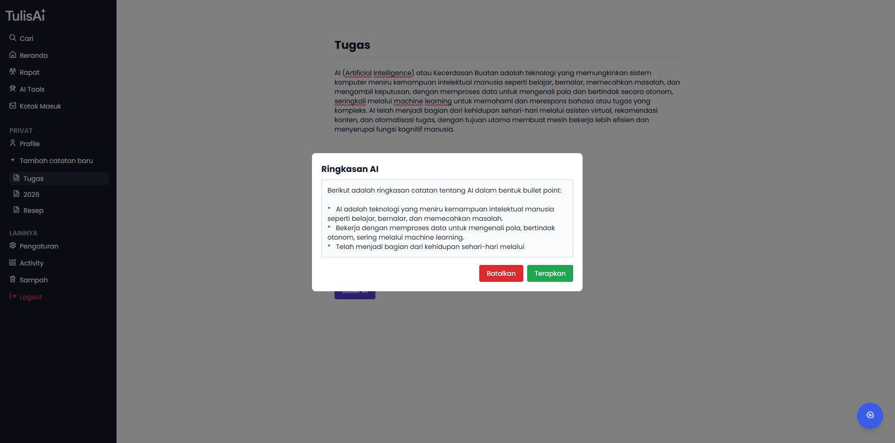
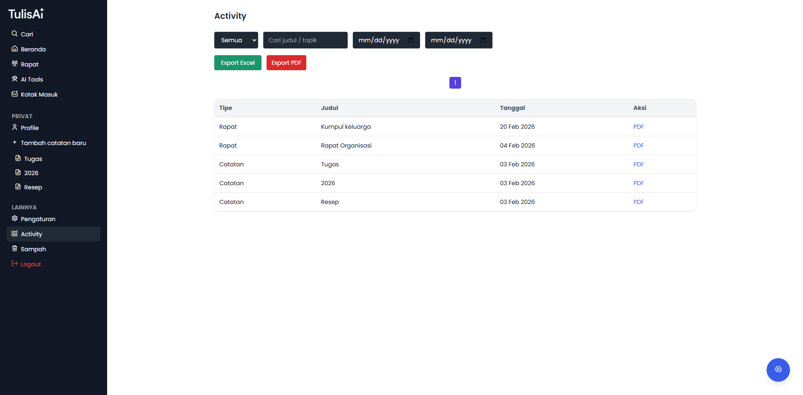
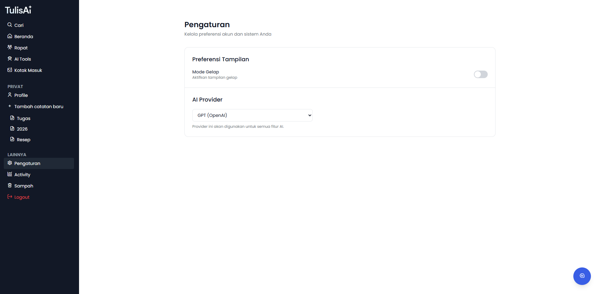
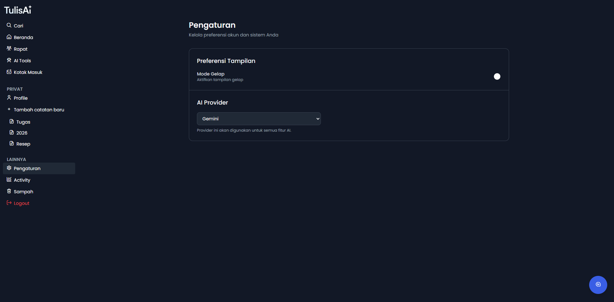
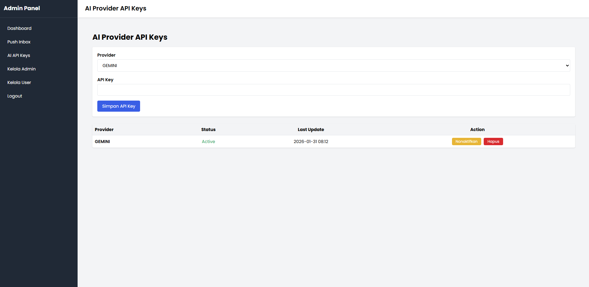

# 23g_flask_asisten_tulis

<p align="center">
  Sistem Asisten Penulisan Berbasis Flask
</p>

<p align="center">
  
  
  
  
  
</p>

---

## Tentang Proyek

**23g_flask_asisten_tulis (TulisAI)** adalah aplikasi berbasis Flask yang terintegrasi dengan AI untuk membantu proses penulisan jadi lebih cepat, lebih rapi, dan lebih efisien

---

## Fitur Utama

- AI Writing Assistant (Saran & Perbaikan Otomatis) | Membantu pengguna untuk menulis lebih rapi, jelas & grammar + strukturnya yang diperbaiki.
- Tool Summarizer & Translation | Membantu pengguna mengubah catatan panjang menjadi ringkas dengan mengambil poin-poin yang penting, dan bisa menerjemahkan teks ke bahasa lain.
- Suggestion note, membantu dalam penulisan catatan agar isi konten sesuai kebutuhan.
- Dapat mengekspor catatan atau rapat yang sudah dibuat dalam format pdf atau excel.
- Terintegrasi dengan beberapa model AI (Gemini, GPT, Deepseek & Grok) dapat diubah sesuai kebutuhan.

---

## 🛠️ Teknologi yang Digunakan

- **Flask (Python)**
- **Gemini API**
- **Jinja2**
- **DB MySQL**

---

## Kelompok NeoByte

<table>
<tbody>
<tr>

<td align="center" width="20%">
  <a href="https://github.com/akslzero"><br /><sub><b>Aksyal</b></sub></a>
</td>

<td align="center" width="20%">
  <a href="https://github.com/andreantaufikh"><br /><sub><b>Andrean</b></sub></a>
</td>

<td align="center" width="20%">
  <a href="https://github.com/RaizelF"><br /><sub><b>Fathih</b></sub></a>
</td>

<td align="center" width="20%">
  <a href="https://github.com/Gansputra"><br /><sub><b>Ganang</b></sub></a>
</td>

</tr>
</tbody>
</table>

---

## 📥 Instalasi

1. Clone repositori:

```bash
git clone https://github.com/kampusriset/23g_flask_asisten_tulis.git
```

2. Masuk ke folder proyek:

```bash
cd 23g_flask_asisten_tulis
```

3. Install dependencies:

```bash
pip install -r requirements.txt
```

4. Install npm:

```bash
npm install
```

5. Build tailwindcss:

```bash
npm run build-css
```

```bash
npm run watch-css
```

6. Setup Database:

```bash
cp .env.example .env
```

7. Migrate Database:

```bash
flask db migrate
```

```bash
flask db upgrade
```

8. Jalankan server Flask:

```bash
python app.py
```

---


## Preview Hasil

### Dashboard


### Rapat


### Profile


### AI Tools




### Catatan


### Activity


### Setting




### Admin Panel API Key



---


## 🎥 Demo Video

Klik gambar di bawah untuk melihat demo penggunaan aplikasi secara langsung:

[](https://youtu.be/yyo4zW-AFgI)

Video ini menampilkan alur penggunaan aplikasi, mulai dari dashboard, fitur utama, hingga pengaturan sistem.


## 🤝 Kontribusi

Terima kasih atas kontribusi semua pihak atas project ini
Kami sangat menghargai issue dan PR/masukkan ❤️


